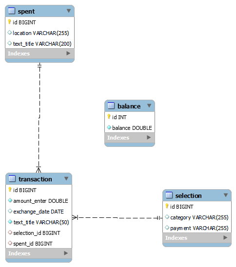

# Little Expense tracker
## About The Project
A whole stack Project that allows tracking user expense activities. Users enter spending activities information into the sites and information. A simple user Site that provides vital information in spreadsheet forms. No need for complex Excel spreadsheets or countless physical papers. This service offers simple user inputs with ReactJS while tracking all information to Java back-ends with Spring Boots and storing it in the MySQL database.

This is the client-side GitHub repo. 
Link to server side: https://github.com/LyonKhang/LETBackend.git
### Table of Contents
<!-- TABLE OF CONTENTS -->
  * [_About The Project_](#about-the-project)
  * [_Technologies Used_](#technologies-used)
  * [_Extension on Visual Studio Code_](#extension-on-visual-studio-code)
  * [_Prerequisites_](#prerequisites)
  * [_Installation and Run_](#installation-and-run)
  * [_Architecture_](#architecture)
  * [_Experiences Gained_](#experiences-gained)
  * [_Contributing_](#contributing)
  * [_License_](#license)
  * [_Acknowledgements_](#acknowledgements)

## Technologies Used
### Server: [![Spring][Spring-boot]][Spring-boot-url]
[![Java][Java]][Java-url]  [![Apache-Maven-Badge]][Apache-Maven-Badge-url]

### Client: [![React][React.js]][React-url]
[![JavaScript][JavaScript]][JavaScript-url]
![HTML5-Badge]
![CSS3 Badge]
### Development:  ![VSCode]
[![Postman Badge]][Postman Badge-url]
![MySQL Badge]

## Extension on Visual Studio Code
### Server:
* **Spring Boot Extension Pack v0.2.1**: a stand-alone platform that makes Java productions more streamlined. this extension Provides Java IDE Spring boot to VS Code.

* **Extension Pack for Java v0.28.0**: Collections of Java extension for VS Code

### Client:
* **JavaScript (ES6) code snippets v1.8.0**: provides Javascripts ES6 syntax for VS Code
 
* **JavaScript and TypeScript Nightly v5.6.20240807**: provides for both TypeScript and JavaScript Nightly build and also IntelliSense.

* **HTML CSS Support v2.0.10**: provide HTML and CSS Intellisense for VS Code.

* **Postman v1.2.1**: testing APIs directly in VS Code.

## Prerequisites
### Server:
* **Java 17 LTS**: Java JDK for development environmenrt.

* **Apache Maven 3.9.5**:a build automation tool used primarily for Java projects.

* **Eclipse Temurin Adoptium**:a Prebuilt java OpenJDK Binaries envrioemnt. This needs to be installed to work with Spring Boot.

### Client: None
### Development
* **Visual Studio Code**:Prefer newest version
* **Postman**: API for offers design, build, test, and projects.

* **My SQL Workbench**: visual database design tool.

## Installation and Run
**Installation**:
Clone repository:
 
Server: https://github.com/LyonKhang/LETBackend.git
 
Client: https://github.com/LyonKhang/LET-FrontEnd.git
 
Import the project to Visual Studio Code.

### Server:
**Setup**:
1. Go to src/main/resources/application.properties
2. Change your URL, username, and password so it works with your MySQL workbench.

**Run**
1. On VScode, navigate to Spring Boot Dashboard at the activity bar.
2. On Spring Boot Dashboard, click run at the apps.
3. go to localhost:8080 on web address bar.
### Client:

 **Run** 
 
 1. navigate to the project folder 
 2. Open the command prompt and type: npm start
 3. It will located at localhost:3000 on web address bar
    
(<a href="#about-the-project">back to top</a>)

    
## Architecture

### Endpoints
| HTTP      | Endpoint                         | Request Body | Response Body     | Description                      |
| ----------|:--------------------------------:| ------------:| -----------------:| ---------------------------------|
| `GET`     |`/balance/calculateBalance`       |      -       |   `Balance`       | Get total balance                | 

| HTTP      | Endpoint                         | Request Body | Response Body     | Description                      | 
| ----------|:--------------------------------:| ------------:| -----------------:| ---------------------------------|
| `POST`    | `selections/newselections/`      | `Selections` | `Selections`      | Create a new selection           |  
| `GET`     | `selections/getselections/`      |       -      | `<List<Selection>`| Get  selection                   | 
| `PUT`     | `selections/editselection/`      | `Selections` | `Selections`      | Edit selection based on id       | 
| `DELETE`  | `selections/editselection/{id}`  |      -       |       -           | Delete a selection on based on id|

| HTTP      | Endpoint                             | Request Body | Response Body | Description                      | 
| ----------|:------------------------------------:| --------:| -----------------:| ---------------------------------|
| `POST`    | `spents/newspents/`                  | `Spents` | `Spents`          | create a new spents              |  
| `GET`     | `spents/getspents/`                  |       -  | `<List<Spents>`   | get  spents                      | 
| `PUT`     | `spents/editspent/`                  | `Spents` | `Spents`          | edit spents based on id          | 
| `DELETE`  | `spents/deletespent/{id}`            |      -   |       -           | Delete a spents on based on id   |

| HTTP      | Endpoint                             | Request Body | Response Body | Description                      | 
| ----------|:------------------------------------:| --------:| -----------------:|----------------------------------|
| `POST`    | `transactions/newtransactions/`      | `Transactions` | `Transactions`          | create a new transactions              |  
| `GET`     | `transactions/gettransactions/`      |      -   | `<List<Transactions>`   | get  transactions                      | 
| `PUT`     | `transactions/edittransaction/`      | `Transactions` | `Transactions`          | edit transactions based on id          | 
| `DELETE`  | `transactions/deletetransaction/{id}`|      -   |       -           | Delete a transactions on based on id   |

(<a href="#about-the-project">back to top</a>)

## Experiences Gained
I learned whole stack operations of apps with a combination of Spring Boot 3, React JS, and MySQL to create a serviceable product:
* Spring Boot 3 operations on the back-end sides.
* Use RESTful API design principles:
   * GET API for a fetch request
   * POST API for creating JSON data forms.
   * PUT API for editing existing forms.
   * DELETE API for deleting requests.
* Learn Project Lombok in VS Code
* Convert user input into JSON to communicate on both sides.
* Use My SQL to store JSON and organize it into multiple tables based on categories.
* Understand the basic React JS on the front-end sides. Another experience is formatting the website to provide services to users.
* Binding buttons with requests with Axios to backends.
* Commit effective message from angular js Github.

## Contributing
1. Fork this project to to GitHub account
2. Clone this project to your machines.
3.  Create a new branch where you can make changes
4.  once finished changes, commit with messages following the Commit Message Format
[Commit Formatting](https://gist.github.com/brianclements/841ea7bffdb01346392c)
## License
This Project uses MIT license (2024)
## Acknowledgements
This project uses icons and badges at.
Commit Message is greatly inspired by 's committing message body convention. This technique greatly keeps the message short but very effective.

(<a href="#about-the-project">back to top</a>)

<!-- MARKDOWN LINKS & IMAGES -->
<!-- https://www.markdownguide.org/basic-syntax/#reference-style-links -->
[Java]: https://img.shields.io/badge/Java-ED8B00?style=for-the-badge&logo=openjdk&logoColor=white
[Java-url]: https://www.java.com/en/
[Spring-boot]: https://img.shields.io/badge/SpringBoot-6DB33F?style=flat-square&logo=Spring&logoColor=white
[Spring-boot-url]: https://spring.io/projects/spring-boot
[Apache-Maven-Badge]: https://img.shields.io/badge/Apache%20Maven-C71A36?logo=apachemaven&logoColor=fff&style=for-the-badge
[Apache-Maven-Badge-url]: https://maven.apache.org/
[JavaScript]: https://img.shields.io/badge/javascript-%23323330.svg?style=for-the-badge&logo=javascript&logoColor=%23F7DF1E
[JavaScript-url]: https://www.oracle.com/developer/javascript/
[React.js]: https://img.shields.io/badge/React-20232A?style=for-the-badge&logo=react&logoColor=61DAFB](https://img.shields.io/badge/-ReactJs-61DAFB?logo=react&logoColor=white&style=for-the-badge
[React-url]: https://reactjs.org/
[HTML5-Badge]:https://img.shields.io/badge/HTML5-E34F26?logo=html5&logoColor=fff&style=for-the-badge
[CSS3 Badge]: https://img.shields.io/badge/CSS3-1572B6?logo=css3&logoColor=fff&style=for-the-badge
[VSCode]:https://img.shields.io/badge/Made%20for-VSCode-1f425f.svg
[Postman Badge]: https://img.shields.io/badge/Postman-FF6C37?logo=postman&logoColor=fff&style=for-the-badge
[Postman Badge-url]: https://www.postman.com
[MySQL Badge]: https://img.shields.io/badge/MySQL-4479A1?logo=mysql&logoColor=fff&style=for-the-badge
